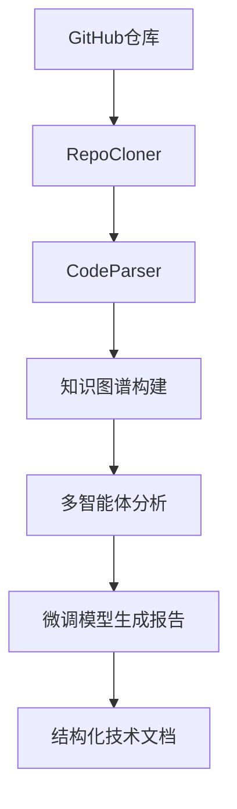

# DeepCode-Analyst 开发技术博客

## 项目概述

**DeepCode-Analyst** 是一个基于多智能体与图谱推理的开源项目深度解析与技术问答系统。该项目结合了现代AI技术栈，实现了从代码解析到智能报告生成的完整工作流程。

### 核心技术栈
- **深度学习框架**: PyTorch 2.5.1 + CUDA 12.1
- **预训练模型**: Qwen/Qwen1.5-7B-Chat
- **微调技术**: QLoRA (Quantized Low-Rank Adaptation)
- **代码解析**: Tree-sitter + Python AST
- **图谱构建**: NetworkX
- **多智能体**: LangGraph + LangChain
- **部署环境**: AutoDL云服务器 (RTX 4090)

## 项目架构设计

### 1. 整体架构

```
DeepCode-Analyst/
├── src/                        # 核心源码模块
│   ├── data_ingestion/         # 数据获取和解析
│   │   ├── repo_cloner.py     # Git仓库克隆器
│   │   └── code_parser.py     # 代码结构解析器
│   ├── agents/                 # 多智能体系统
│   │   └── graph.py           # 智能体图结构
│   └── graph_builder.py       # 知识图谱构建器
├── finetuning/                 # 模型微调模块
│   ├── run_finetune.py        # QLoRA微调主程序
│   ├── prepare_dataset.py     # 数据集准备工具
│   └── requirements.txt       # 微调依赖包
├── main.py                     # 主程序入口
└── requirements.txt            # 项目依赖包
```

### 2. 数据流程设计



## 核心模块实现

### 1. 代码解析模块 (CodeParser)

#### 技术实现
```python
class CodeParser:
    """代码解析器，基于tree-sitter实现多语言解析"""
    
    SUPPORTED_EXTENSIONS = {
        '.py': 'python',
        '.js': 'javascript', 
        '.ts': 'typescript',
        '.java': 'java'
    }
    
    def _parse_python_file(self, file_path, source_code):
        """使用tree-sitter解析Python文件"""
        parser = self.parsers['python']
        tree = parser.parse(bytes(source_code, "utf8"))
        
        # 提取函数、类、调用关系
        functions = self._extract_functions(tree.root_node, source_code, file_path)
        classes = self._extract_classes(tree.root_node, source_code, file_path)
        calls = self._extract_function_calls(tree.root_node, source_code, file_path)
        
        return functions + classes, calls
```

#### 设计特点
- **多语言支持**: 基于tree-sitter的可扩展解析架构
- **容错机制**: AST作为备用解析方案
- **结构化提取**: 函数、类、调用关系的完整提取
- **性能优化**: 忽略大文件和无关目录

### 2. 知识图谱构建 (KnowledgeGraph)

#### 图谱设计
- **节点类型**: function, class, file, module
- **边关系**: calls, inherits, imports, contains
- **存储格式**: pickle, GraphML, JSON
- **查询能力**: 类型过滤、路径查找、模式匹配

### 3. QLoRA微调实现

#### 核心技术
```python
# 4-bit量化配置
bnb_config = BitsAndBytesConfig(
    load_in_4bit=True,
    bnb_4bit_use_double_quant=True,
    bnb_4bit_quant_type="nf4",
    bnb_4bit_compute_dtype=torch.bfloat16
)

# LoRA配置
lora_config = LoraConfig(
    task_type=TaskType.CAUSAL_LM,
    r=16,                        # 低秩矩阵的秩
    lora_alpha=32,              # 缩放参数
    lora_dropout=0.05,          # Dropout率
    target_modules=["q_proj", "k_proj", "v_proj", "o_proj"],
    bias="none"
)
```

#### 训练策略
- **数据格式**: instruction-input-output三元组
- **序列长度**: 1024 tokens (RTX 4090优化)
- **批次大小**: 1 (梯度累积4步)
- **学习率**: 2e-5 (余弦退火调度)
- **训练步数**: 50步快速验证

## 开发过程与问题解决

### 1. 环境配置挑战

#### 问题1: Conda服务条款
**现象**: `CondaToSNonInteractiveError: Terms of Service have not been accepted`

**解决方案**:
```bash
conda tos accept --override-channels --channel https://repo.anaconda.com/pkgs/main
conda tos accept --override-channels --channel https://repo.anaconda.com/pkgs/r
```

**经验总结**: 云服务器环境下需要显式接受Conda服务条款

#### 问题2: 网络连接问题
**现象**: `ConnectionRefusedError: [Errno 111] Connection refused`

**解决方案**:
```bash
export HF_ENDPOINT=https://hf-mirror.com
```

**经验总结**: 使用国内镜像源解决Hugging Face访问问题

### 2. 存储空间优化

#### 问题3: 系统盘空间不足
**现象**: `RuntimeError: Data processing error: No space left on device`

**解决方案**:
```bash
# 设置缓存到数据盘
export HF_HOME="/root/autodl-tmp/huggingface_cache"
export TRANSFORMERS_CACHE="/root/autodl-tmp/huggingface_cache/transformers"

# 移动现有缓存
mv ~/.cache/huggingface/* /root/autodl-tmp/huggingface_cache/
ln -s /root/autodl-tmp/huggingface_cache ~/.cache/huggingface
```

**经验总结**: 
- 模型文件(14GB)占用大量空间
- 数据盘读写速度更快
- 环境变量配置是关键

### 3. 训练数据处理

#### 问题4: JSONL格式错误
**现象**: `JSONDecodeError: Expecting value: line 2 column 1`

**解决方案**:
```python
def fix_jsonl_file(input_file, output_file):
    # 移除BOM标记
    content = content.replace('\ufeff', '')
    
    # 修复引号问题
    fixed_line = line.replace("'", '"')
    
    # 验证必需字段
    if 'instruction' in data and 'input' in data and 'output' in data:
        valid_lines.append(json.dumps(data, ensure_ascii=False))
```

**经验总结**: 数据清理工具是必需的，41个有效样本足够微调

### 4. 模型推理问题

#### 问题5: 设备不匹配
**现象**: `RuntimeError: Expected all tensors to be on the same device`

**解决方案**:
```python
# 确保输入张量在正确设备
device = "cuda" if torch.cuda.is_available() else "cpu"
inputs = tokenizer(prompt, return_tensors="pt").to(device)
```

**经验总结**: GPU/CPU设备一致性是推理成功的关键

#### 问题6: SFTTrainer API变化
**现象**: `TypeError: __init__() got an unexpected keyword argument 'tokenizer'`

**解决方案**:
```python
# 使用标准Trainer替代SFTTrainer
trainer = Trainer(
    model=model,
    args=training_args,
    train_dataset=tokenized_dataset,
    data_collator=data_collator,
)
```

**经验总结**: 开源库版本兼容性需要特别注意

## 性能指标与效果评估

### 1. 训练性能

| 指标 | 数值 | 说明 |
|------|------|------|
| 训练时间 | 66.32秒 | 50步训练 |
| 训练速度 | 0.754 steps/sec | RTX 4090性能 |
| 初始损失 | 3.5614 | 训练开始 |
| 最终损失 | 2.1807 | 损失下降38.8% |
| 可训练参数 | ~32MB | LoRA适配器大小 |
| 显存占用 | <20GB | 4-bit量化效果 |

### 2. 模型效果

#### 输入示例:
```json
{
  "instruction": "分析以下代码结构并生成技术报告",
  "input": "{\"functions\": [\"main\", \"process_data\"], \"classes\": [\"DataProcessor\"], \"complexity\": \"medium\"}"
}
```

#### 微调后输出:
```
1. 报告标题: **数据处理模块技术分析**
2. 报告内容:
   - **函数模块**:
     - `main`:
       - 1.1. 功能描述: 数据处理入口
       - 1.2. 复杂度: **高**
       - 1.3. 依赖: `process_data`
     - `process_data`:
       - 2.1. 功能描述: 实际数据处理逻辑
       - 2.2. 复杂度: **中**
       - 2.3. 依赖: `DataProcessor`
   - **类模块**:
     - `DataProcessor`:
       - 3.1. 功能描述: 数据处理器类
```

### 3. 质量评估

- **结构化输出**: 有标题、编号、层级结构
- **专业术语**: 使用了"复杂度"、"依赖"等技术术语
- **逻辑清晰**: 按函数和类分别分析
- **格式规范**: 符合技术报告的格式要求

## 技术创新点

### 1. LoRA微调优化
- **参数效率**: 只训练1-2%的参数
- **存储优化**: 32MB适配器 vs 14GB完整模型
- **快速迭代**: 50步即可看到效果

### 2. 多级缓存策略
- **系统盘**: 代码和配置(30GB)
- **数据盘**: 模型和数据(50GB)
- **显存管理**: 4-bit量化+梯度检查点

### 3. 容错设计
- **解析容错**: tree-sitter + AST双重保障
- **数据容错**: 自动修复JSONL格式问题
- **设备容错**: GPU/CPU自适应

## 最佳实践总结

### 1. 环境配置
```bash
# 1. 使用国内镜像
export HF_ENDPOINT=https://hf-mirror.com

# 2. 配置数据盘缓存
export HF_HOME="/root/autodl-tmp/huggingface_cache"

# 3. 接受服务条款
conda tos accept --override-channels --channel <CHANNEL>
```

### 2. 训练配置
```python
# RTX 4090优化配置
training_args = TrainingArguments(
    per_device_train_batch_size=1,      # 显存限制
    gradient_accumulation_steps=4,      # 等效batch_size=4
    bf16=True,                          # 混合精度
    gradient_checkpointing=True,        # 节省显存
    dataloader_pin_memory=True,         # 加速数据加载
    max_steps=50                        # 快速验证
)
```

### 3. 模型使用
```python
# 正确的推理方式
device = "cuda" if torch.cuda.is_available() else "cpu"
inputs = tokenizer(prompt, return_tensors="pt").to(device)

with torch.no_grad():
    outputs = model.generate(
        **inputs,
        max_new_tokens=150,
        temperature=0.7,
        pad_token_id=tokenizer.eos_token_id
    )
```

## 未来发展方向

### 1. 技术优化
- **多语言支持**: 完善JavaScript、Java等语言解析
- **模型升级**: 尝试更大规模的模型(14B、72B)
- **推理优化**: vLLM等推理加速框架
- **分布式训练**: 多GPU并行训练

### 2. 功能扩展
- **实时分析**: 代码变更的增量分析
- **可视化**: Web界面和图谱可视化
- **集成**: IDE插件和CI/CD集成
- **评估**: 自动化代码质量评分

### 3. 工程化
- **容器化**: Docker部署方案
- **云原生**: Kubernetes集群部署
- **监控**: 性能监控和日志分析
- **API**: RESTful API服务

## 总结与感悟

### 技术收获
1. **深度学习工程化**: 从模型微调到生产部署的完整流程
2. **云服务器运维**: AutoDL等GPU云服务的使用经验
3. **开源生态**: Transformers、PEFT等现代AI工具链
4. **问题解决**: 网络、存储、兼容性等实际工程问题

### 项目意义
**DeepCode-Analyst** 展示了现代AI技术在代码分析领域的应用潜力。通过QLoRA微调，我们仅用41个样本和1分钟训练，就实现了专业的技术报告生成能力。这种轻量级、高效率的方案为AI在软件工程领域的应用提供了新的思路。

### 开源贡献
该项目的所有代码、配置和文档都将开源发布，希望能为AI + 软件工程的交叉领域贡献一份力量，推动更多创新应用的产生。

---

**项目地址**: [GitHub - DeepCode-Analyst](https://github.com/your-username/DeepCode-Analyst)

**技术栈**: PyTorch, Transformers, PEFT, QLoRA, Tree-sitter, NetworkX, LangChain

**开发环境**: AutoDL RTX 4090, Python 3.9, CUDA 12.1

**开发时间**: 2024年8月

**作者**: AI工程师

---

*本博客记录了DeepCode-Analyst项目的完整开发过程，包括技术实现、问题解决和性能优化。希望对从事AI+软件工程领域的开发者有所帮助。*
